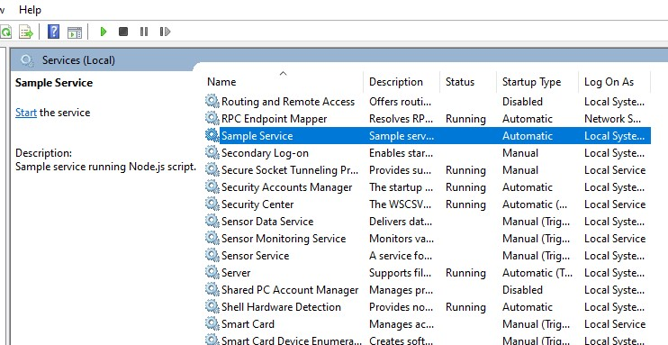

# desktop-service

Run Node.js scripts as native services on Windows, Mac OS and Linux.

## Usage

```javascript
var Service = require('desktop-service');

var svc = new Service({
  name: 'Sample Service',
  description: 'Sample service running Node.js script.',
  script: require('path').join(__dirname, 'service.js'),
});

svc.on('install', function () {
  svc.start();
});

svc.install();
```

After the installation the service will be listed like any other service in the service management
utility of the OS.



## Environment Variables

Sometimes you may want to provide a service with static data, passed
in on creation of the service. You can do this by setting environment
variables in the service config, as shown below:

```javascript
var svc = new Service({
  name: 'Sample service',
  description: 'Sample service running Node.js script.',
  script: require('path').join(__dirname, 'service.js'),
  env: [
    {
      name: 'HOME',
      value: process.env['USERPROFILE'], // service is now able to access the user who created its home directory
    },
    {
      name: 'TEMP',
      value: path.join(process.env['USERPROFILE'], '/temp'), // use a temp directory in user's home directory
    },
  ],
});
```

## Uninstalling a Service

```javascript
var Service = require('desktop-service');

var svc = new Service({
  name: 'Sample Service',
  script: path.join(__dirname, 'service.js'),
});

svc.on('uninstall', function () {
  console.log('Uninstall complete.');
  console.log('The service exists: ', svc.exists);
});

svc.uninstall();
```

Note that the uninstall process only removes process-specific files.
It does not delete your Node.js script.
